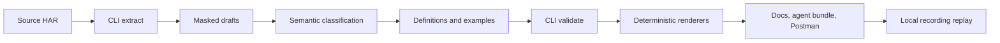

# Architecture

apimesh is a vendorable toolchain. Application repositories own their collections and generated artifacts; they pin the toolchain independently, usually as a Git submodule at `vendor/apimesh/`. Vendor `schema/` and `workflow/` together, preserving their relative layout. A complete checkout also carries documentation, licensing, and upstream CI.

## Toolchain and collection boundaries

```text
apimesh/                         # This repository
  schema/                        # Canonical contracts
  workflow/
    cli/                         # Executor, renderers, replay, tests
    skills/                      # Evidence-based semantic workflows
    templates/                   # Metadata starters and application setup templates
  .github/workflows/ci.yml        # Toolchain verification
  ARCHITECTURE.md
  DEVELOPMENT.md

application/                     # Consuming repository
  vendor/apimesh/                 # Pinned toolchain
  collection.json
  glossary.json
  package.json                   # Scripts delegate to pinned CLI
  .github/workflows/verify.yml    # Application verification
  AGENTS.md                      # Collection maintenance instructions
  sources/                       # Reviewed original HAR evidence
  apis/<host>/<path>/             # Maintained canonical corpus
  dist/{docs,agent,postman}/       # Generated, committed outputs
  .raw/                          # Ignored extraction drafts
  .reports/                      # Ignored diagnostics
```

| Layer | Owner | Contract |
|---|---|---|
| `schema/`, `workflow/` | apimesh | Reusable code, schemas, skills and metadata starters |
| `collection.json`, `glossary.json`, `apis/` | Application maintainers and semantic skills | Evidence-backed identities, meanings and recordings |
| `sources/` | Recording provider | Preserve originals; review before sharing |
| `.raw/`, `.reports/` | CLI | Disposable processing outputs |
| `dist/` | CLI | Deterministic consumer artifacts generated from canonical inputs |

## Execution context

`ProjectPaths` carries both an absolute collection `root` and the executing `toolchainRoot`. All default input, artifact and report paths belong to the collection; `schema` belongs to the toolchain. Commands resolve this context once and pass it to corpus loaders and renderers.

The toolchain location derives from the executing module, never from collection files or the working directory. Collections cannot shadow its schemas by adding their own `schema/` directory. The compiled CLI must stay at `workflow/cli/dist/` beside the rest of the pinned toolchain.

`apic --root <directory> <command>` targets exactly that directory. Without `--root`, discovery walks upward from the working directory to the nearest `collection.json` or `glossary.json`, then requires both files. An incomplete nested collection fails locally rather than silently selecting its parent. Toolchain metadata templates are excluded from discovery and cannot be explicitly targeted. `init` instead targets `--root` or the current directory without requiring metadata; it refuses to initialize inside the executing toolchain.

`apic init` copies missing application setup files from toolchain templates and preserves existing files without merging. The application owns those copies after initialization. The npm `init` entry point restores its original caller directory before resolving `--root`. Shared extraction and verification stay in the toolchain; application-specific preprocessing stays in the application. An import report must come from actual work and is not a bootstrap template.

`apic verify` composes strict validation, two renders with a complete path/byte comparison, and local replay. Its stage report belongs in `.reports/verify.json`; it stops on failure and does not claim source coverage. Optional `--committed` checks generated files against Git HEAD before and after rendering, including staged/untracked/ignored files. Generated application CI enables that check; ordinary local verification allows expected uncommitted outputs.

Explicit HAR paths and `--out` paths remain relative to the caller's working directory. `--root` does not change that directory. Default `.raw/`, `.reports/` and `dist/` paths resolve under the selected collection. Run the built CLI directly from the application root to avoid npm's package-directory working-directory behavior.

Generated replay instructions use the toolchain's collection-relative path when it is inside the collection. For an external toolchain, or a vendor path requiring shell-specific escaping, they use `apic --root .`, with instructions to put that CLI on PATH; machine-specific absolute paths are never embedded in consumer output. Reproducibility assumes the same collection inputs, toolchain version and relative vendor layout.

## Processing flow



Humans provide recordings and review changes. Skills classify observations, maintain stable semantic variant slugs, and explain evidence. Deterministic code masks, deduplicates, validates, renders, compares drift, and replays recordings. HTTP status and business code values describe observations, not inferred meaning. Unsupported captures and ambiguity remain explicit; passing validation alone does not establish complete classification or live availability.

## Collection directories

The following contracts consolidate the former directory READMEs. These directories are created in consuming collections as needed; the toolchain does not ship empty artifact trees.

## Source recordings

Original HAR (HTTP Archive) recordings.

### File conventions

- Export recordings manually from browser developer tools or another HAR-compatible recorder.
- Include request and response content needed for classification and replay.
- Use distinct, descriptive filenames; a source label and capture timestamp are recommended.
- Preserve existing recordings. Add new captures as separate files.
- Store only source recordings here.
- HAR files may contain sensitive data. Review recordings before committing them.

## Canonical API corpus

The authoritative endpoint definitions and masked recordings used to generate consumer outputs.

Each endpoint directory contains `definition.json`, `examples/`, and optional `notes.md`. Skills own canonical edits; the CLI reads this corpus for validation, rendering, drift detection, and replay testing.

Definitions include `endpoint.url` (origin and path) and request `headers`, `query`, `body` sections. Parameter descriptions are optional and contain only supported meanings. Examples retain request `headers`, `query`, `body` and response `headers`, `body`; absent bodies omit `bodyMeta`. Cookies remain solely in masked Cookie/Set-Cookie headers, including repeated header values. There is no separate `cookies` field.

Directories group static endpoint paths by their actual host:

```text
apis/
  api.example.invalid/
    catalog/items/
      definition.json
      examples/200.code0.ok.json
      notes.md
  auth.example.invalid/
    catalog/items/
      definition.json
      examples/200.code0.ok.json
```

For `https://api.example.invalid/catalog/items`, use `apis/api.example.invalid/catalog/items/` and set `endpoint.url` to that URL. Host categories come from the URL, not the labels in `collection.bases`. Preserve globally unique API identifiers across hosts. Each host/path directory supports one method and origin; different methods or HTTP/HTTPS origins sharing the same host/path still require a modeling decision. The `/` endpoint lives directly in its host directory.

Host directory names use `encodeURIComponent(new URL(endpoint.url).host)`, keeping DNS names readable and escaping ports and IPv6 brackets/colons (for example, `localhost%3A8080` and `%5B%3A%3A1%5D%3A8080`). Escape a trailing dot as `%2E`; for Windows device names such as `con`, percent-encode the first character (`%63on`). The CLI's `endpointDirectory` helper implements this convention. Endpoint path segments retain their existing static spelling and must be representable as directories.

Example filenames include HTTP status, business code, and variant slug, such as `200.code0.ok.json`.

To migrate a path-only collection, add `endpoint.url` from its recordings, move each entire endpoint directory under its host, and preserve API IDs, example filenames, and variant references. Split mixed-host definitions using their recorded origins before moving them. Update any handwritten path links, then run `validate`, `render --all`, and `test`. Legacy path-only directories produce `legacy-api-directory` warnings (`--strict` fails on warnings); incorrect host directories are errors. Rendering uses the new artifact layout while keeping canonical links pointed at their actual source files.

Examples support `request.httpMeta.httpVersion`, `response.httpMeta.httpVersion`, and `response.httpMeta.entryTime`. HTTP versions retain the captured labels (for example, `HTTP/1.1` or `h2`); `entryTime` is the HAR entry's total elapsed time in milliseconds. Extraction fills these automatically when available. Unknown values are omitted, and legacy examples may omit `httpMeta` entirely. Body representation remains in `bodyMeta`.

See the [schemas](schema/) for accepted formats and the [classification instructions](workflow/skills/classify/SKILL.md) for naming rules, or collection output `dist/docs/summary.md` to browse the APIs.

## Extraction drafts

Regenerable YAML drafts produced by `apic extract` from HAR captures and consumed by the `classify` skill.

This is scratch storage. The authoritative corpus lives in `apis/`. Drafts and their ownership manifest are gitignored; their contracts are documented here.

Extraction updates only unchanged files recorded in `.apic-extract.json`; unrelated files remain untouched. See the [CLI guide](workflow/cli/README.md) for usage and constraints.

## CLI reports

Diagnostics produced by extraction, validation, and drift detection. The report formats are not frozen.

Commands write these reports directly; `apic render` does not regenerate them.

- `extract-*.json`: endpoint, frame, and duplicate counts from `apic extract`.
- `validate.json`: schema and cross-reference issues from `apic validate`.
- `drift-*.json`: advisory capture differences from `apic drift`, interpreted by the drift skill.

## Distribution outputs

Consumer artifacts produced by the CLI. Generated files are intended to be committed and consumed directly; update their inputs and regenerate them.

- `docs/`: human-readable API documentation.
- `agent/`: compact API and variant metadata for agents.
- `postman/`: importable collection and environment.

Endpoint artifacts share the same host/path hierarchy as canonical data. Shared navigation and setup files stay at each consumer's root:

```text
dist/
  docs/
    summary.md
    usage.md
    endpoints/<host>/<path>/index.md
  agent/
    index.json
    summary.md
    endpoints/<host>/<path>/index.json
    schema/*.schema.json
  postman/
    endpoints.postman_collection.json
    replay.postman_environment.json
```

For root endpoints, omit `<path>/`. Postman folders follow host → endpoint → recording. Keeping endpoint pages under `endpoints/` avoids collisions with shared files such as `summary.md` or `usage.md`. Agent index format 2 includes `host` and links the new detail paths; consumers should follow those links instead of constructing filenames from API IDs. Regenerate with `apic render --all` after upgrading, and update external links or Postman imports. Old generated files are removed during rendering; top-level handwritten READMEs are preserved. Legacy definitions without a single known host render under `endpoints/_legacy/` until migrated.

Extraction, validation, and drift diagnostics are disposable workflow outputs in gitignored `.reports/`, outside the distribution.

Optional application-authored directory READMEs are preserved by rendering. The summaries in `docs/` and `agent/` are generated indexes of their artifacts.

## API documentation

Entry points: `dist/docs/summary.md` and `dist/docs/usage.md`.

Endpoint pages list parameters, response fields and recordings. Canonical links provide complete captures.

Browse `endpoints/<host>/<path>/index.md`; the API index includes each endpoint's host. Root endpoints use `endpoints/<host>/index.md`.

Regenerate with `apic render --docs`.

## Agent bundle

Entry points: `dist/agent/summary.md` and `dist/agent/index.json`.

Index format **2** links endpoint details containing parameters, response shapes and recording references. Follow `definitionFile` for capture headers and each example's `file` for complete requests and responses.

Each index entry includes `host`. Details live at `endpoints/<host>/<path>/index.json`, matching the human documentation hierarchy; follow `detailFile` and `docsFile` for exact paths.

JSON paths are relative to the collection repository root (`pathBase: repository-root`). Parameter `default` values are observations. The `schema/` copies describe canonical source formats.

Regenerate with `apic render --agent`.

## Postman artifacts

Import the collection `dist/postman/endpoints.postman_collection.json` and environment `dist/postman/replay.postman_environment.json`.

Use `apicReplay=true` for local recordings; use a separate environment with `apicReplay=false` and your own values for live requests. Setup is in the generated `dist/docs/usage.md`.

Regenerate with `apic render --postman`.

Requests are grouped into host folders, then endpoint folders, then individual recordings. Each recording retains its actual origin variable for live requests.

## Verification and upgrades

Toolchain CI builds and tests supported Node versions using synthetic collections, including copied vendor installations and external collections. Collection CI belongs to the application: install/build its pinned toolchain, validate, render twice, compare file sets and bytes, check committed output synchronization including untracked files, and replay every recording.

Upgrade the vendor commit, review schema and CLI compatibility, reinstall dependencies when needed, rebuild, and repeat the collection checks. Keep application data outside vendor. Existing forks can retain their canonical layout: move the toolchain into `vendor/apimesh/`, update command paths and skill references, and remove redundant application schema copies after verifying the upgrade. No canonical format migration is introduced by this boundary change.

See [DEVELOPMENT.md](DEVELOPMENT.md) for setup and migration, and [CLI documentation](workflow/cli/README.md) for command limits.
